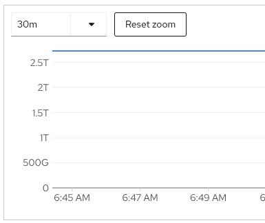
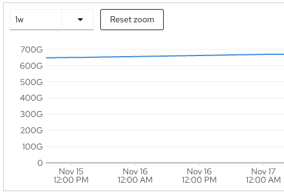

These acceptance tests are based on the [NERC Operational Use Cases](https://docs.google.com/document/u/0/d/1dHHpWvJD4b1mdXTDQhgWhiGeOLY7N7FmwvgI5VB3tP0/edit).

Reference for NERC OpenStack: [https://nerc-project.github.io/nerc-docs/get-started/user-onboarding-on-NERC/](https://nerc-project.github.io/nerc-docs/get-started/user-onboarding-on-NERC/)

Acceptance testers will require access to the following applications:

* OpenShift admin access (cluster-admins, nerc-org-admins, nerc-ops groups in OpenShift) to access the Observability dashboards and cluster logging.
* ColdFront admin access, because most OpenShift verification steps amd some of the ColdFront verification steps (delete a user) require admin access.
* VPN access to XDMoD, to view the reports for OpenShift resources.

## Managing Users


1. **Request a new account**
    * _As a new user, I should be able to create an account for myself in the NERC._
    * Criteria
        1. A prospective user follows the steps documented in [https://nerc-project.github.io/nerc-docs/get-started/create-a-user-portal-account/](https://nerc-project.github.io/nerc-docs/get-started/create-a-user-portal-account/) to create an account on the NERC.
    * Acceptance tests:
        1. Check that an OpenShift User exists, with access to the project allocations:
            1. Create a new user account [following the How to Create a User Account documentation](https://nerc-project.github.io/nerc-docs/get-started/create-a-user-portal-account/).
            2. The user must accept the [Acceptable Use Notice](https://regapp.mss.mghpcc.org/reglanding/) during the sign up process. This is shown to all users and without approval doesn't allow account creation.
            3. For a given username of `nerc-test-account` for example, check that the given username is listed in the `oc` CLI:
                ```bash
                $ oc get user/nerc-test-account
                NAME               UID                                   FULL NAME  IDENTITIES
                nerc-test-account  db6324f8-e3df-4543-a40c-3fecb91b5204
                ```
            4. For a given username of `nerc-test-account` and a namespace of `01234567-89ab-cdef-0123-456789abcdef` for example, check the user's RoleBindings exist:
                ```bash
                $ oc get RoleBinding -n 01234567-89ab-cdef-0123-456789abcdef -o wide
                NAME               ROLE              AGE  USERS
                nerc-test-account  ClusterRole/edit  7s   nerc-test-account
                ```
            5. Verify that the given username has a RoleBinding with `Role ref` of `edit`, for the project's namespaces.
            6. Try logging into OpenShift as the user to test the Keycloak authentication.
2. **Remove a user**
    * _As an administrator, I should be able to remove a user from their projects and allocations._
    * Criteria
        1. A NERC admin can follow the steps documented in [What is NERC's ColdFront?](https://github.com/nerc-project/nerc-docs/blob/main/docs/get-started/get-an-allocation.md#adding-and-removing-user-from-the-project) to remove a user from a project on the NERC. A NERC admin can also use a private runbook to disable/ deactivate a user from KeyCloak.
        2. The user can no longer access their project.
    * Acceptance tests:
        1. A NERC admin can follow the steps documented in [What is NERC's ColdFront?](https://github.com/nerc-project/nerc-docs/blob/main/docs/get-started/get-an-allocation.md#adding-and-removing-user-from-the-project) to remove a user from a project on the NERC.
        2. Check that the user no longer has access to the project in OpenShift.
            1. For a given username of `nerc-test-account` for example, [Click here to check  the user's RoleBindings](https://console-openshift-console.apps.nerc-ocp-prod.rc.fas.harvard.edu/k8s/cluster/user.openshift.io~v1~User/nerc-test-account/roles).
            2. Verify that the given username no longer has a RoleBinding with `Role ref` of `edit`, for the project's namespaces.
3. **Add/Remove PI privilege to a user**
    * _For any user account, the administrator should be able to add or remove PI status associated with that account.  A user may be a PI on multiple projects, but a project can have only 1 PI._
    * Criteria
        1. User creates a new account as described in section 1. [See the ColdFront documentation here](https://nerc-project.github.io/nerc-docs/get-started/get-an-allocation/).
        2. User fills out the PI request form.
        3. To approve the request, NERC admin assigns the user to the PI role on KeyCloak`s user management.
        4. NERC admin approves the request and responds with a ticket reply.
        5. To remove the PI role, just reverse the step c. And send out an email to the user informing about it.
    * Acceptance tests:
        1. Create the new user account in ColdFront.
        2. Fill out the PI request form.
        3. Assign the USER the PI role in Keycloak.
        4. Check that an OpenShift User exists, with access to the project allocations:
            1. Approve the user's request in ColdFront.
            2. Because ColdFront users and managers will have the same access of `edit` on the project, there is no difference in OpenShift roles between a user and a manager.
            3. For a given username of `nerc-test-account` and a namespace of `01234567-89ab-cdef-0123-456789abcdef` for example, check the user's RoleBindings exist:
                ```bash
                $ oc get RoleBinding -n 01234567-89ab-cdef-0123-456789abcdef -o wide
                NAME               ROLE              AGE  USERS
                nerc-test-account  ClusterRole/edit  7s   nerc-test-account
                ```
            4. Verify that the given username has a RoleBinding with `Role ref` of `edit`, for the project's namespaces.
        5. Check that an OpenShift User exists, with access to the project allocations:
            1. See the [Adding User to Manager Role](https://nerc-project.github.io/nerc-docs/get-started/get-an-allocation/#adding-user-to-manager-role) documentation to also remove the PI role from a user.
            2. Click on the edit icon next to the user's name on the Project Detail page.
            3. Then toggle the "Role" from Manager to User.
            4. Approve the request to remove the PI role from the user in ColdFront.
            5. Because ColdFront users and managers will have the same access of `edit` on the project, there is no difference in OpenShift roles between a user and a manager.
            6. For a given username of `nerc-test-account` and a namespace of `01234567-89ab-cdef-0123-456789abcdef` for example, check the user's RoleBindings exist:
                ```bash
                $ oc get RoleBinding -n 01234567-89ab-cdef-0123-456789abcdef -o wide
                NAME               ROLE              AGE  USERS
                nerc-test-account  ClusterRole/edit  7s   nerc-test-account
                ```
            7. Verify that the given username has a RoleBinding with `Role ref` of `edit`, for the project's namespaces.


## Manage Projects


1. **Add a new project**
    * _As a user who is a PI, I should be able to create a project by._
    * Criteria
        1. User has previously been set as a PI.
        2. User logs in to ColdFront and requests a project by going to Home → Projects and by clicking on `Create Project`. [See the ColdFront documentation here](https://nerc-project.github.io/nerc-docs/get-started/get-an-allocation/).
        3. User requests a resource allocation on the `OpenShift` resource for the above created project.
        4. Administrator approves the request.
        5. Upon approval, a project will be created in OpenShift for this particular allocation. If the user does not already exist in OpenShift the user will be created. The project created will have the following attributes
            1. Project name prefixed by a random 6 char hex
            2. Project ID / namespace as a uuid
            3. Requested quota attributes.
        6. The user will be able to authenticate using Keycloak and their institutional login.
    * Acceptance tests:
        1. Setup the user as a PI in ColdFront, see `Add/Remove PI privilege to a user` above.
        2. Log into ColdFront as the user and request a project, [See the ColdFront documentation here](https://nerc-project.github.io/nerc-docs/get-started/get-an-allocation/).
        3. As the user, request an OpenShift resource allocation in ColdFront.
            1. The PI must accept the End User License Agreement for the resource allocation request, for each new resource allocation. (See image below and "Placeholder for EULA" text box for OpenStack. It is only displayed to the PI requesting the allocation at the moment of the request and not to other users that may be later added.)

                
        4. Log into ColdFront as an admin and approve the request.
        5. Validate the project was created with the requested quota:
            1. For a given project named `012345myproject` for example, check that the given project is listed in the `oc` CLI:
                ```bash
                $ oc get project/012345myproject
                NAME               DISPLAY NAME  STATUS
                012345myproject                  Active
                ```
            2. For a given namespace named `01234567-89ab-cdef-0123-456789abcdef` for example,  check that the given namespace is listed in the `oc` CLI:
                ```bash
                $ oc get namespace/01234567-89ab-cdef-0123-456789abcdef
                NAME                                  STATUS  AGE
                01234567-89ab-cdef-0123-456789abcdef  Active  14m
                ```
            3. You can explore quotas from within the Observability dashboard. For a given project named `012345myproject`, and resource `limits.cpu` or `limits.memory` for example, [Click here to check the `value` for the type=hard (max limit) and type=used (current value)](https://multicloud-console.apps.nerc-ocp-infra.rc.fas.harvard.edu/grafana/explore?orgId=1&left=%5B%22now-1h%22,%22now%22,%22Observatorium%22,%7B%22exemplar%22:true,%22expr%22:%22kube_resourcequota%7Bcluster%3D%5C%22nerc-ocp-prod%5C%22,namespace%3D%5C%2201234567-89ab-cdef-0123-456789abcdef%5C%22,resource%3D%5C%22limits.cpu%5C%22%7D%22%7D%5D).

                
        6. Check that an OpenShift User exists, with access to the project allocations:
            1. For a given username of `nerc-test-account` for example, check that the given username is listed in the `oc` CLI:
                ```bash
                $ oc get user/nerc-test-account
                NAME               UID                                   FULL NAME  IDENTITIES
                nerc-test-account  db6324f8-e3df-4543-a40c-3fecb91b5204
                ```
            2. For a given username of `nerc-test-account` and a namespace of `01234567-89ab-cdef-0123-456789abcdef` for example, check the user's RoleBindings exist:
                ```bash
                $ oc get RoleBinding -n 01234567-89ab-cdef-0123-456789abcdef -o wide
                NAME               ROLE              AGE  USERS
                nerc-test-account  ClusterRole/edit  7s   nerc-test-account
                ```
            3. Verify that the given username has a RoleBinding with `Role ref` of `edit`, for the project's namespaces.
            4. Try logging into OpenShift as the user to test the Keycloak authentication.
2. **Deactivate a project or resource allocation**
    * _As an administrator, I should be able to archive any project or resource allocation and release the resources associated with it back to the pool._
    * Criteria
        1. A ColdFront admin can navigate to the project. [See the ColdFront documentation here](https://nerc-project.github.io/nerc-docs/get-started/get-an-allocation/).
            1. They can archive a project and expire all associated allocations by clicking `archive project` by navigating to the project and clicking `archive project`.
            2. They can navigate to an allocation, set the status to `Denied`, and update the allocation
        2. Disabling an allocation will delete the associated OpenShift namespace, which differs from OpenStack behavior which simply disables the project.
    * Acceptance tests:
        1. Validate that the project allocations have been removed from the  project users and managers.
            1. As an admin in ColdFront, archive the project.
            2. For a given username of `nerc-test-account` and a namespace of `01234567-89ab-cdef-0123-456789abcdef` for example, check the user's RoleBindings have been removed:
                1. As an admin in ColdFront, set the allocation status to `Denied`, and update the allocation.
                2. Check that the RoleBinding no longer exists:
                    ```bash
                    $ oc get RoleBinding -n 01234567-89ab-cdef-0123-456789abcdef -o wide
                    NAME               ROLE              AGE  USERS
                    ```
        2. Validate the project was deleted, as well as the namespaces:
            1. As an admin in ColdFront, disable the allocation for the project.
            2. For a given project named `012345myproject` for example, check that the given project is no longer listed in the `oc` CLI:
                ```bash
                $ oc get project/012345myproject
                NAME               DISPLAY NAME  STATUS
                ```
            3. For a given namespace named `01234567-89ab-cdef-0123-456789abcdef` for example,  check that the given namespace is no longer listed in the `oc` CLI:
                ```bash
                $ oc get namespace/01234567-89ab-cdef-0123-456789abcdef
                NAME                                  STATUS  AGE
                ```
3. **Manage a project as a PI.**
    * _As a PI, I should be able to manage and share my project with others on the team, but no one except the the administrator should be able to remove the project._
    * Criteria
        1. A PI can add keycloak users to a ColdFront project under the `users` section in the given project ([https://nerc-project.github.io/nerc-docs/get-started/get-an-allocation/#adding-and-removing-user-from-the-project](https://nerc-project.github.io/nerc-docs/get-started/get-an-allocation/#adding-and-removing-user-from-the-project))
        2. From here, a PI can set the user to a particular role.
            1. The `manager` role has an `edit` role to the project, and is the one that lets users create and remove allocations by delegating PI role/responsibilities in ColdFront.
            2. The `user` role also has an `edit` role to the project, but cannot create and remove allocations.
    * Acceptance tests:
        1. Because ColdFront gives the same `edit` role to a Manager and a User, you can expect all users and PIs in a project to share the same role. For a given namespace named `01234567-89ab-cdef-0123-456789abcdef`, and a given user named `nerc-test-account`, and the given role `edit`, check that the given project contains a RoleBinding with a `Role ref` of `edit`, a `Subject kind` of `User`, and a `Subject name` of `nerc-test-account` in the `oc` CLI:
            1. `oc get RoleBinding -n 01234567-89ab-cdef-0123-456789abcdef -o wide`
        2. After making any changes to user roles, check that the given project contains a RoleBinding with a `Role ref` of `edit`, a `Subject kind` of `User`, and a `Subject name` of `nerc-test-account` for all Users and PIs in the `oc` CLI:
            1. `oc get RoleBinding -n 01234567-89ab-cdef-0123-456789abcdef -o wide`


## Manage Quota


1. **Set and modify quotas for projects**
    * _As an administrator of the cluster, I should be able to set and modify compute, storage and object counts quotas for any project._
    * Criteria
        1. For modifying attributes, allocation change requests can be requested by navigating to the active allocation.[See the ColdFront documentation here](https://nerc-project.github.io/nerc-docs/get-started/get-an-allocation/)
        2. From here, a PI can approve the request and a call to the acct-mgt service will be made.
            1. For setting attributes, adding a new allocation attribute triggers a call to the acct-mgt service endpoint `/projects/{project_id}/quota`.
    * Acceptance tests:
        1. As a ColdFront admin, make a request to change an allocation's attributes.
        2. As a ColdFront admin, approve the request.
            1. You can explore quotas from within the Observability dashboard. For a given project named `012345myproject`, and resource `limits.cpu` or `limits.memory` for example, [Click here to check the `value` has been updated for the type=hard (max limit) and type=used (current value)](https://multicloud-console.apps.nerc-ocp-infra.rc.fas.harvard.edu/grafana/explore?orgId=1&left=%5B%22now-1h%22,%22now%22,%22Observatorium%22,%7B%22exemplar%22:true,%22expr%22:%22kube_resourcequota%7Bcluster%3D%5C%22nerc-ocp-prod%5C%22,namespace%3D%5C%2201234567-89ab-cdef-0123-456789abcdef%5C%22,resource%3D%5C%22limits.cpu%5C%22%7D%22%7D%5D).

                


## Managing Authorization Policy


1. **View and Manage Role bindings**
    * _As an administrator of the cluster, I should be able to create, view and manage role bindings for the users in the cluster._
    * Criteria
        1. After a user is added, an admin can go to the user `actions` tab and set their role to `manager` or `user`.
            1. [https://nerc-project.github.io/nerc-docs/get-started/get-an-allocation/#adding-and-removing-user-from-the-project](https://nerc-project.github.io/nerc-docs/get-started/get-an-allocation/#adding-and-removing-user-from-the-project)
    * Acceptance tests:
        1. For a given username of `nerc-test-account` and a namespace of `01234567-89ab-cdef-0123-456789abcdef` and a role of `edit` for example, check the user's RoleBindings exist:
            1. As a ColdFront admin, set the user's role to `manager`.
            2. Check the user role bindings.
                ```bash
                $ oc get RoleBinding -n 01234567-89ab-cdef-0123-456789abcdef -o wide
                NAME               ROLE              AGE  USERS
                nerc-test-account  ClusterRole/edit  7s   nerc-test-account
                ```
            3. Because ColdFront users and managers will have the same access of `edit` on the project, there is no difference in OpenShift roles between a user and a manager.


## Documentation


1. **Online Documentation**
    * _As an administrator or a user, I should be able to perform any routine operations by referring to online documentation which lists the steps that need to be taken to complete an operation._
    * Criteria
        1. Administrator/user accesses documentation at:
            1. [https://nerc-project.github.io/nerc-docs/](https://nerc-project.github.io/nerc-docs/)
        2. Administrator accesses XDMoD documentation at:
            1. [XDMoD Upstream](https://github.com/ubccr/xdmod/blob/xdmod10.5/README.md)
            2. [MOC XDMoD OpenStack Readme](https://github.com/CCI-MOC/xdmod-cntr/blob/main/README.md)
            3. [NERC XDMoD OpenShift Readme](https://github.com/OCP-on-NERC/xdmod-openshift-scripts/blob/main/README.md)
            4. [NERC XDMoD OpenShift Integration](https://github.com/OCP-on-NERC/docs/blob/main/xdmod_integration.md)
        3. Administrator accesses ColdFront documentation at:
            1. [What is NERC's ColdFront](https://github.com/nerc-project/nerc-docs/blob/main/docs/get-started/get-an-allocation.md)
            2. [OpenStack Plugin for ColdFront](https://github.com/nerc-project/coldfront-plugin-cloud)
            3. [Core ColdFront Upstream - Resource Allocation System](https://github.com/ubccr/coldfront)
    * Acceptance tests:
        1. Verify the administrator/user has access to the main documentation.
        2. Verify the administrator has access to the XDMoD documentation.
        3. Verify the administrator has access to the ColdFront documentation.


## Hardware Management


1. **Add and track new hardware**
    * _As an administrator of the cluster, I should be able to add nodes to the cluster. I should also be able to view all the nodes and their status._
    * Criteria
        1. Netbox
    * Acceptance tests:
        1. Add new nodes to the cluster.
            1. [Here is the spreadsheet for managing new hardware](https://docs.google.com/spreadsheets/d/1piV0GKyVG6KznnXCLJO4MgwSYCl9dV4VEMuY7M1_bnM/edit?usp=share_link).
            2. [Click here to view the ACM Observability Grafana dashboards](https://multicloud-console.apps.nerc-ocp-infra.rc.fas.harvard.edu/grafana/). These dashboards provide insights into Control Plane Health, Optimization, Capacity, Utilization and more. You can change the timespan in the top right to show results in terms of minutes, hours, days, months or years.

                
2. **Track faulty hardware**
    * _As an administrator of the cluster, I should be able to view and track the list of faulty nodes that need to be replaced._
    * Criteria
        1. Nagios or refer to notes in Netbox
    * Acceptance tests:
        1. Track faulty nodes that need to be replaced.
            1. [Here is the spreadsheet for managing faulty hardware](https://docs.google.com/spreadsheets/d/1i2pxVyaSn2XxP-kWJyUmfJJZm8v63YmYBoeOP8M_BWg/edit?usp=share_link).
            2. [Click here to view the ACM Observability Grafana dashboards](https://multicloud-console.apps.nerc-ocp-infra.rc.fas.harvard.edu/grafana/). These dashboards provide insights into Control Plane Health, Optimization, Capacity, Utilization and more. You can change the timespan in the top right to show results in terms of minutes, hours, days, months or years.

                


## Upgrade


1. **Establish OpenShift cluster upgrade process**
    * _As an administrator of the cluster, I should be able to follow a set of documented instructions to help me in upgrading to newer versions of OpenShift. The rule book should also establish the process to mitigate any issues that might arise during the upgrade._
    * Criteria
        1. See the official [OpenShift updating clusters documentation](https://docs.openshift.com/container-platform/4.10/updating/index.html) for the version of OpenShift to which you wish to upgrade.
        2. Follow the instructions to update the cluster.
    * Acceptance tests:
        1. Verify the administrator has access to the OpenShift updating clusters documentation.
        2. You can explore cluster versions and upgrades from within the Observability dashboard. For a given cluster named `nerc-ocp-prod` from version `4.10.13` to version `4.10.15` for example, [Click here to check the `from_version` of the `cluster` type record, and the `version` of the `completed` type record to ensure the versions are what you expected](https://multicloud-console.apps.nerc-ocp-infra.rc.fas.harvard.edu/grafana/explore?orgId=1&left=%5B%22now-1h%22,%22now%22,%22Observatorium%22,%7B%22exemplar%22:true,%22expr%22:%22avg%28cluster_version%7Bcluster%3D%5C%22nerc-ocp-prod%5C%22,%20type%3D~%5C%22cluster%7Ccompleted%5C%22%7D%29%20by%20%28Time,%20cluster,%20from_version,%20type,%20version%29%22%7D%5D).

## Monitoring


1. **Generate and share operations alerts**
    * _As an administrator of the cluster, I should be able to generate and share operation alerts in OpenShift using the monitoring tools available in the NERC cluster._
    * Criteria
        1. Adding alerts to Slack involves creating a pull request with the alert name, summary, description, expression, for, and labels in the `thanos-ruler-custom-rules` ConfigMap. It also requires adding the corresponding alert names to the matchers in the `open-cluster-management-observability-alertmanager-config` ExternalSecret. [Click here to see an example pull request of adding custom alerts to Slack](https://github.com/OCP-on-NERC/nerc-ocp-config/pull/103).
    * Acceptance tests:
        1. Create pull request of adding custom alerts to Slack, [similar to this PR](https://github.com/OCP-on-NERC/nerc-ocp-config/pull/103).
            1. [Click here to check that alerts are sent to `alerts-nerc-ocp` channel in Slack](https://app.slack.com/client/T14CVG7L1/C044ZCTUWCV/thread/C027TDE52TZ-1666641224.695039).

                
2. **Logging**
    * _As an administrator of the cluster, I should be able to track all the events in the cluster using the logging system in OpenShift._
    * Criteria
        1. [Click here to visit the Logging Grafana instance](https://logging-grafana.apps.nerc-ocp-infra.rc.fas.harvard.edu).
        2. Click on the `Explore` button which looks like a compass on the left side. At the top of that page, you can select from the dropdown the infrastructure, audit or application logs. You can then use the Log Browser to browse the different labels like kubernetes_host and select a value for a tag to filter in on actual search results. Continue to add more labels and values to narrow in on the logs you wish to see.
        3. You can build custom dashboards and alerts in this Logging Grafana instance.
    * Acceptance tests:
        1. [Click here to visit the Logging Grafana instance](https://logging-grafana.apps.nerc-ocp-infra.rc.fas.harvard.edu).
        2. Explore the logs as described and ensure you are finding the logs you are looking for.

            
        3. Add any dashboards and alerts you wish to test.
            1. Log archiving and rollover could run the Ceph Storage out of space. Check on log storage space consumed vs. available using these OpenShift metrics:
                1. [OpenShift Data Foundations Ceph Storage Total Storage](https://console-openshift-console.apps.nerc-ocp-infra.rc.fas.harvard.edu/monitoring/query-browser?query0=sum%28%28kube_persistentvolumeclaim_resource_requests_storage_bytes+*+on+%28namespace%2Cpersistentvolumeclaim%29+group_right%28%29+kube_pod_spec_volumes_persistentvolumeclaims_info%29+*+on+%28namespace%2Cpersistentvolumeclaim%29+group_left%28storageclass%2C+provisioner%29+%28kube_persistentvolumeclaim_info+*+on+%28storageclass%29++group_left%28provisioner%29+kube_storageclass_info+%7Bprovisioner%3D%7E%22%28.*rbd.csi.ceph.com%29%7C%28.*cephfs.csi.ceph.com%29%7C%28ceph.rook.io%2Fblock%29%22%7D%29%29)

                    
                2. [OpenShift Data Foundations Ceph Storage Storage Used](https://console-openshift-console.apps.nerc-ocp-infra.rc.fas.harvard.edu/monitoring/query-browser?query0=sum%28%28kubelet_volume_stats_used_bytes+*+on+%28namespace%2Cpersistentvolumeclaim%29+group_right%28%29+kube_pod_spec_volumes_persistentvolumeclaims_info%29+*+on+%28namespace%2Cpersistentvolumeclaim%29+group_left%28storageclass%2C+provisioner%29+%28kube_persistentvolumeclaim_info+*+on+%28storageclass%29++group_left%28provisioner%29+kube_storageclass_info+%7Bprovisioner%3D%7E%22%28.*rbd.csi.ceph.com%29%7C%28.*cephfs.csi.ceph.com%29%7C%28ceph.rook.io%2Fblock%29%22%7D%29%29)

                    
                3. [OpenShift Data Foundations Ceph Storage Percent Used](https://console-openshift-console.apps.nerc-ocp-infra.rc.fas.harvard.edu/monitoring/query-browser?query0=sum%28%28kubelet_volume_stats_used_bytes+*+on+%28namespace%2Cpersistentvolumeclaim%29+group_right%28%29+kube_pod_spec_volumes_persistentvolumeclaims_info%29+*+on+%28namespace%2Cpersistentvolumeclaim%29+group_left%28storageclass%2C+provisioner%29+%28kube_persistentvolumeclaim_info+*+on+%28storageclass%29++group_left%28provisioner%29+kube_storageclass_info+%7Bprovisioner%3D%7E%22%28.*rbd.csi.ceph.com%29%7C%28.*cephfs.csi.ceph.com%29%7C%28ceph.rook.io%2Fblock%29%22%7D%29%29%2Fsum%28%28kube_persistentvolumeclaim_resource_requests_storage_bytes+*+on+%28namespace%2Cpersistentvolumeclaim%29+group_right%28%29+kube_pod_spec_volumes_persistentvolumeclaims_info%29+*+on+%28namespace%2Cpersistentvolumeclaim%29+group_left%28storageclass%2C+provisioner%29+%28kube_persistentvolumeclaim_info+*+on+%28storageclass%29++group_left%28provisioner%29+kube_storageclass_info+%7Bprovisioner%3D%7E%22%28.*rbd.csi.ceph.com%29%7C%28.*cephfs.csi.ceph.com%29%7C%28ceph.rook.io%2Fblock%29%22%7D%29%29)

                    
3. **Monitoring and logging for the infrastructure hardware and software that is not OpenShift (for example Grafana)**
    * _As a NERC administrator, I should be able to monitor the status of any infrastructure software or hardware that supports operations for the NERC OpenShift environment, even if it is not itself part of OpenShift._
    * Criteria
        1. You can access many metrics for pods of a particular application like grafana or loki.
    * Acceptance tests:
        1. See the available logs and metrics:

            1. Available logs:
                1. [Click here to visit the cpu usage logs for dex](https://multicloud-console.apps.nerc-ocp-infra.rc.fas.harvard.edu/grafana/explore?orgId=1&left=%5B%22now-1h%22,%22now%22,%22Observatorium%22,%7B%22exemplar%22:true,%22expr%22:%22node_namespace_pod_container:container_cpu_usage_seconds_total:sum_rate%7Bnamespace%3D%5C%22dex%5C%22%7D%22%7D%5D).
                2. [Click here to visit the cpu usage logs for gitops](https://multicloud-console.apps.nerc-ocp-infra.rc.fas.harvard.edu/grafana/explore?orgId=1&left=%5B%22now-1h%22,%22now%22,%22Observatorium%22,%7B%22exemplar%22:true,%22expr%22:%22node_namespace_pod_container:container_cpu_usage_seconds_total:sum_rate%7Bnamespace%3D%5C%22openshift-gitops%5C%22%7D%22%7D%5D).
                2. [Click here to visit the cpu usage logs for grafana](https://multicloud-console.apps.nerc-ocp-infra.rc.fas.harvard.edu/grafana/explore?orgId=1&left=%5B%22now-1h%22,%22now%22,%22Observatorium%22,%7B%22exemplar%22:true,%22expr%22:%22node_namespace_pod_container:container_cpu_usage_seconds_total:sum_rate%7Bnamespace%3D%5C%22grafana%5C%22%7D%22%7D%5D).

                    
                3. [Click here to visit the cpu usage logs for logging](https://multicloud-console.apps.nerc-ocp-infra.rc.fas.harvard.edu/grafana/explore?orgId=1&left=%5B%22now-1h%22,%22now%22,%22Observatorium%22,%7B%22exemplar%22:true,%22expr%22:%22node_namespace_pod_container:container_cpu_usage_seconds_total:sum_rate%7Bnamespace%3D%5C%22openshift-logging%5C%22%7D%22%7D%5D).
                4. [Click here to visit the cpu usage logs for loki](https://multicloud-console.apps.nerc-ocp-infra.rc.fas.harvard.edu/grafana/explore?orgId=1&left=%5B%22now-1h%22,%22now%22,%22Observatorium%22,%7B%22exemplar%22:true,%22expr%22:%22node_namespace_pod_container:container_cpu_usage_seconds_total:sum_rate%7Bnamespace%3D%5C%22openshift-operators-redhat%5C%22%7D%22%7D%5D).
                5. [Click here to visit the cpu usage logs for vault](https://multicloud-console.apps.nerc-ocp-infra.rc.fas.harvard.edu/grafana/explore?orgId=1&left=%5B%22now-1h%22,%22now%22,%22Observatorium%22,%7B%22exemplar%22:true,%22expr%22:%22node_namespace_pod_container:container_cpu_usage_seconds_total:sum_rate%7Bnamespace%3D%5C%22vault%5C%22%7D%22%7D%5D).
                6. [Click here to visit the cpu usage logs for xdmod](https://multicloud-console.apps.nerc-ocp-infra.rc.fas.harvard.edu/grafana/explore?orgId=1&left=%5B%22now-1h%22,%22now%22,%22Observatorium%22,%7B%22exemplar%22:true,%22expr%22:%22node_namespace_pod_container:container_cpu_usage_seconds_total:sum_rate%7Bnamespace%3D%5C%22xdmod%5C%22%7D%22%7D%5D).

            2. Available metrics:

                1. There are metrics that are available in OpenShift that may not be available in Observability. Here is an example of how to query [OpenShift Data Foundations Ceph Storage Percent Used Metric](https://console-openshift-console.apps.nerc-ocp-infra.rc.fas.harvard.edu/monitoring/query-browser?query0=sum%28%28kubelet_volume_stats_used_bytes+*+on+%28namespace%2Cpersistentvolumeclaim%29+group_right%28%29+kube_pod_spec_volumes_persistentvolumeclaims_info%29+*+on+%28namespace%2Cpersistentvolumeclaim%29+group_left%28storageclass%2C+provisioner%29+%28kube_persistentvolumeclaim_info+*+on+%28storageclass%29++group_left%28provisioner%29+kube_storageclass_info+%7Bprovisioner%3D%7E%22%28.*rbd.csi.ceph.com%29%7C%28.*cephfs.csi.ceph.com%29%7C%28ceph.rook.io%2Fblock%29%22%7D%29%29%2Fsum%28%28kube_persistentvolumeclaim_resource_requests_storage_bytes+*+on+%28namespace%2Cpersistentvolumeclaim%29+group_right%28%29+kube_pod_spec_volumes_persistentvolumeclaims_info%29+*+on+%28namespace%2Cpersistentvolumeclaim%29+group_left%28storageclass%2C+provisioner%29+%28kube_persistentvolumeclaim_info+*+on+%28storageclass%29++group_left%28provisioner%29+kube_storageclass_info+%7Bprovisioner%3D%7E%22%28.*rbd.csi.ceph.com%29%7C%28.*cephfs.csi.ceph.com%29%7C%28ceph.rook.io%2Fblock%29%22%7D%29%29)

                    


## Reporting


1. **Track/report usage of the cluster**
    * _As an administrator of the cluster, I should be able to view daily, weekly and monthly reports of the cluster infrastructure utilization._
    * Criteria
        1. Administrator logs into the associated XDMoD instance and views reports.
    * Acceptance tests:
        1. As an administrator, check that the XDMoD utilization of OpenShift resources matches the cpu and memory reported in ACM Observability:
            1. As an admin in XDMoD, view the reports for OpenShift resources.
            2. [Click here to view the ACM Observability Grafana dashboards](https://multicloud-console.apps.nerc-ocp-infra.rc.fas.harvard.edu/grafana/). These dashboards provide insights into Control Plane Health, Optimization, Capacity, Utilization and more. You can change the timespan in the top right to show results in terms of minutes, hours, days, months or years.

                
2. **Track/report usage of the project**
    * _As a user and the owner of a project, I should be able to view daily, weekly and monthly reports of the infrastructure utilization by the projects I own._
    * Criteria
        1. User logs into the associated XDMoD instance and views reports for projects they own.
        2. User cannot view reports for projects they do not own. We will need to look into this, to restrict the view to only projects that they own.
    * Acceptance tests:
        1. As an administrator, check that the XDMoD utilization of project cpu and memory matches the cpu and memory reported for projects in ACM Observability:
            1. As an admin in XDMoD, view the reports for OpenShift projects.
            2. [Click here to view the memory usage of projects over time](https://multicloud-console.apps.nerc-ocp-infra.rc.fas.harvard.edu/grafana/explore?orgId=1&left=%5B%22now-1h%22,%22now%22,%22Observatorium%22,%7B%22exemplar%22:true,%22expr%22:%22namespace:container_memory_usage_bytes:sum%22%7D%5D).

                
            3. [Click here to view the cpu usage of the projects over time](https://multicloud-console.apps.nerc-ocp-infra.rc.fas.harvard.edu/grafana/explore?orgId=1&left=%5B%22now-1h%22,%22now%22,%22Observatorium%22,%7B%22exemplar%22:true,%22expr%22:%22node_namespace_pod_container:container_cpu_usage_seconds_total:sum%22%7D%5D).

                
            4. [Click here to show the projects using the top 5 CPU usage at each point in time](https://multicloud-console.apps.nerc-ocp-infra.rc.fas.harvard.edu/grafana/explore?orgId=1&left=%5B%22now-1h%22,%22now%22,%22Observatorium%22,%7B%22exemplar%22:true,%22expr%22:%22topk%285,%20%281%20-%20avg%28rate%28node_namespace_pod_container:container_cpu_usage_seconds_total:sum%7B%7D%5B$__rate_interval%5D%29%29%20by%20%28namespace%29%29%29%22%7D%5D).

                
        2. Not applicable at this time.


## Data Management


1. **Access operational logs for at least 30 days**
    * _As an administrator of the cluster, I should be able to access operational logs, error messages, alerts, and other relevant data used to investigate and resolve operational issues when they are created.  I should also be able to access this information in place in the operations environment for at least 30 days following its creation._
    * Criteria
        1. Administrator logs, error messages, alerts, and other relevant data used to investigate and resolve operational issues in the logging Grafana and Observability Grafana instance for at least 30 days.
    * Acceptance tests:
        1. See the `Monitoring` and `Reporting` sections above for information about the logs, alerts, and dashboards.
        2. We are not yet able to configure retention of Loki logs to 30 days, because the `RetentionStreamSpec` feature is not yet released in the latest Loki Operator. We plan to enable this retention feature when it becomes available. Here is an [issue where we are tracking this issue regarding log retention](https://github.com/OCP-on-NERC/operations/issues/38).

2. **Access audit logs for at least 90 days**
    * _As an administrator of the cluster, I should be able to access operational information that is specifically useful for security audits and investigations (e.g. records of privilege escalations, certificate changes, etc.) when it is created and for 90 days thereafter._
    * Criteria
        1. Access operational information that is specifically useful for security audits and investigations when it is created and for 90 days thereafter.
    * Acceptance tests:
        1. See the `Monitoring` and `Reporting` sections above for information about the logs, alerts, and dashboards.
        2. We are not yet able to configure retention of Loki logs to 30 days, because the `RetentionStreamSpec` feature is not yet released in the latest Loki Operator. We plan to enable this retention feature when it becomes available. Here is an [issue where we are tracking this issue regarding log retention](https://github.com/OCP-on-NERC/operations/issues/38).

3. **Operational data should be archived and stored securely monthly**
    * _All operational data should be archived and stored securely outside the operations environment monthly.  This operations data will eventually be provided to researchers after appropriate procedures have been established for protecting any sensitive data and controlling researcher access to the data.  Current operations use cases do not call for deleting any archived data.  (Defining procedures for allowing researchers access to the archived data is outside the scope of this document.)_
    * Criteria
        1. All operational data should be archived and stored securely outside the operations environment monthly.
    * Acceptance tests:
        1. The NERC team will be meeting to discuss the approach and acceptance tests for this use case.

4. **Operations data is archived and then removed**
    * _Once operations data is archived, it can be removed from the operations environment._
    * Criteria
        1. Once operations data is archived, it can be removed from the operations environment.
    * Acceptance tests:
        1. The NERC team will be meeting to discuss the approach and acceptance tests for this use case.
