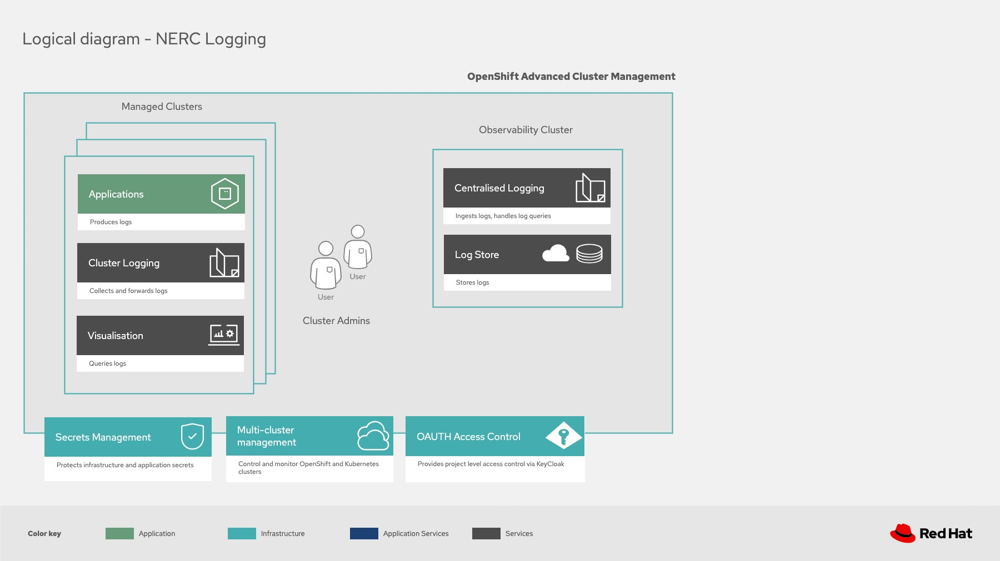
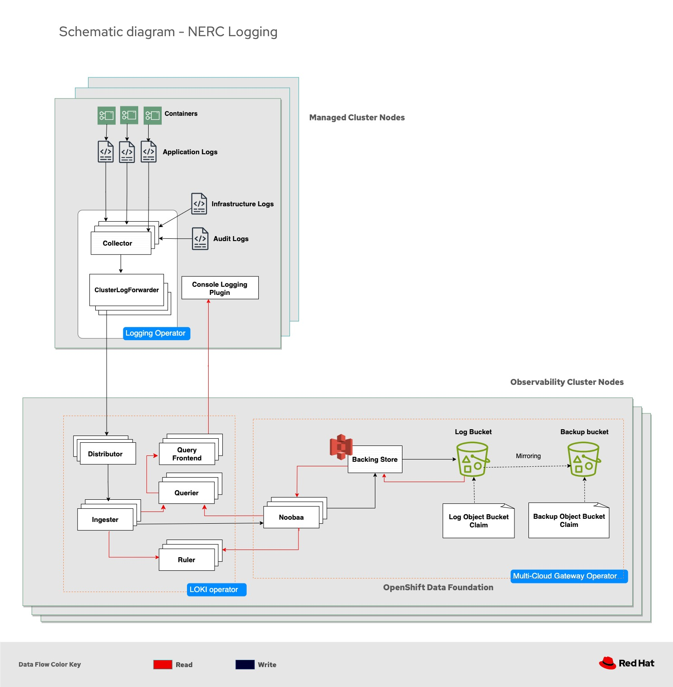

# Logging System

For better understanding of the development, test, deploy and operation, the following diagram identified several parts of the system that composed the structure of the logging system in NERC.

## Schematic Diagram

Logs are written by the clusters managed by [Advanced Cluster Management (ACM)](https://www.redhat.com/en/technologies/management/advanced-cluster-management) and read by the Cluster admins with read permission only.

The below diagram depicts the read and write flow. However, please bear in mind that only essential components are identified for the sake of brevity as lots are happening behind the scene.

## Read path

1. The read request comes from the admin users who have the permission (by adding into [nerc-logs-metrics](https://github.com/orgs/OCP-on-NERC/teams/nerc-logs-metrics) group in GitHub) to read the logs from the OpenShift Production (as an example) Cluster Console.

2. The query request is sent to the LokiStack in the Observability cluster and is handled by the Querier service. This service processes queries using [LogQL](https://grafana.com/docs/loki/latest/query/) query language, fetching logs both from the ingesters and from the long-term storage.

3. To fetch the log data from the long-term storage, the request is forwarded to the NooBaa operator, one of the operators in the [OpenShift Data Foundation](https://www.redhat.com/en/technologies/cloud-computing/openshift-data-foundation) installed in Observability cluster. This operator is responsible to manage [Multicloud Object Gateway](https://www.redhat.com/en/blog/introducing-multi-cloud-object-gateway-for-openshift) components, such as object bucket claim, bucket classes, and backing store in the OpenShift Data Foundation.

4. The backing store handles the read and write request from the customer, as it provides MCG the ability to save the data of the provisioned bucket on top of it. In this architecture, the backing store is [AWS:S3 bucket](https://aws.amazon.com/pm/serv-s3/?gclid=EAIaIQobChMIodfHoK2egwMVwuXVCh2cWw-1EAAYASAAEgLCNvD_BwE&trk=518a7bef-5b4f-4462-ad55-80e5c177f12b&sc_channel=ps&ef_id=EAIaIQobChMIodfHoK2egwMVwuXVCh2cWw-1EAAYASAAEgLCNvD_BwE:G:s&s_kwcid=AL!4422!3!645186213484!e!!g!!aws%20s3!19579892800!143689755565).

6. A S3 bucket is provisioned by a [Object Bucket Claim](https://access.redhat.com/documentation/en-us/red_hat_openshift_container_storage/4.8/html/managing_hybrid_and_multicloud_resources/object-bucket-claim˘) for storing data. And the route for the S3 access is provided by the internal CRD called NooBaa.

> NERC logs are stored inside Log Bucket. Since the logs are purged to keep log size under control, there is also backup of the logs and its corresponding ObjectBucketClaim. The read and write request of logs only involve this Log bucket from any ACM cluster, however Observability cluster can make read request to the Log Backup bucket as well.  The data sync between these two buckets is provisioned by mirroring feature in OpenShift Data Foundation.

7. After getting access to the logs from the bucket, the query returns the data following the reverse path. Query result is sent to the Query frontend instead of Querier to display to the admin users who requested for the log data.

> The LOKI ruler continuously evaluates a set of configurable queries and performs an action based on the result. This component is not directly involved during the read request from the cluster admin users, however to generate alerts it reads the logs from the log store following the same path in the OpenShift Data Foundation.

## Write path

To aggregate the logs (application, infrastructure, and audit) the [Cluster Logging Operator](https://github.com/openshift/cluster-logging-operator) is installed in the ACM production clusters. This operator components collects and forwards logs to the log store to be saved for reading purpose later.

1. Collector daemonset collects logs from each node, transforms the data, and forwards to the store.

2. ClusterLogForwader CR specifies which logs are collected, how they are transformed and where they are forwarded.

3. Logs are then forwarded to the observability cluster where LokiStack is deployed and is used as external log store for the logging system in NERC.

> LokiStack refers to the logging subsystem supported combination of Loki and web proxy with OpenShift Container Platform authentication integration.

4. The forwarded logs are ingested by the Ingester pods of Loki from the Distributor which does validation of logs. Ingesters are responsible for writing the logs to backup store.

5. The LOKI ingesters send the data to NooBaa operator to access the log bucket to write the data which is already setup earlier by OpenShift Data Foundation components.
