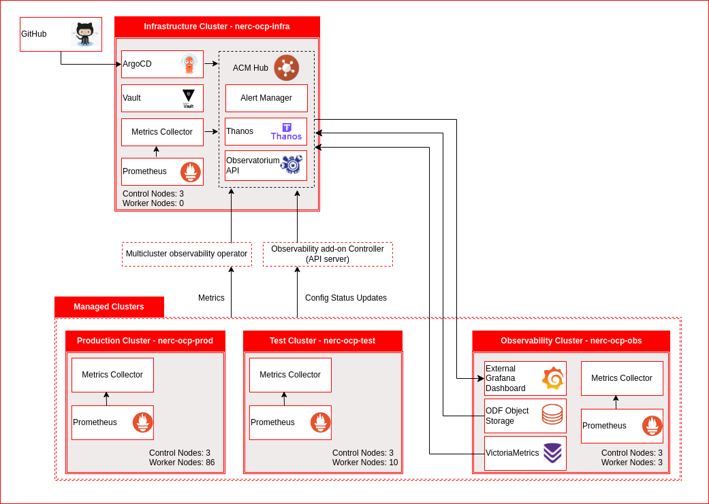

# Background Summary

As the multi-cluster environments at NERC scales and grows it brings cluster management complexities, which makes it necessary to have real-time/near real-time visibility to events, incidents and activities as they occur, especially in the Production and Infrastructure clusters. Having that visibility will allow in taking appropriate actions timely to ensure a high level of resiliency in the NERC clusters and overall infrastructure platform.

# Solution Overview

Red Hat Advanced Cluster Management (RHACM) Observability provides end-to-end visibility of the fleet of clusters in an environment. It consolidates and centralizes all the metrics from each of the clusters it manages. Within the RHACM Hub Cluster, the key items of importance are the Multi-cluster Observability Operator and the Observability Controller API. Both these services are deployed when observability is enabled in RHACM. Once enabled the Observability Controller API collects the metrics data from Prometheus instances in each of the managed OpenShift clusters, mainly the Production cluster (ocp-nerc-prod) and the Test cluster (ocp-nerc-test), and sends them over to the RHACM Hub cluster, which is part of the Infrastructure cluster (ocp-nerc-infra).

The RHACM Hub cluster leverages two main services, Thanos and Observatorium in conjunction with Grafana to deliver an end-to-end single pane view for platform metrics for all managed clusters. Observatorium API enables connectivity and access to Thanos and helps extract the metrics data from all the Prometheus instances in the managed clusters and pushes them into the Object storage leveraging Thanos. Thanos helps  store the metrics data in a predefined object storage such as Red Hat OpenShift Data Foundation (ODF).

Ultimately, the aggregated metrics from all the clusters are served up in the Grafana dashboard.

Observability is included with the RHACM installation, however the service must be enabled in order to use it. Following are the steps to enable observability service in the RHACM Hub cluster:

1. Log in to the RHACM hub cluster
2. Create a namespace for observability in the RHACM hub cluster
3. Create a pull-secret in that same namespace. This will provide the credentials to the namespace to access the image registry
4. Configure a connection to the object storage, in this case it is Red Hat ODF. To accomplish this a secret must be created for ODF, and that secret must include ODF’s credentials
5. Enable the multi-cluster observability add-on. There are a couple of options to accomplish this:
    - Via the OpenShift web console, select the installed operators and clicking on “Create instance” for MultiClusterObservability
    - Create a Custom Resource (CR) and apply it
6. Step #5 will generate a link for Grafana in the RHACM web console once all the necessary pods for Thanos, Grafana and Alertmanager are created, and all the managed clusters are connected to the RHACM Hub cluster and sending their metrics to the RHACM observability service
7. Click on the Grafana link to launch the Grafana dashboard to validate that observability is enabled and metrics data is populated

## Observability workflow

1. The Metrics Collector in the managed clusters (Prod, Test, Obs) gets all the cluster platform level metrics from the local Prometheus in each cluster
2. Observability Controller API collects the metric data from the Metrics Collector in each cluster and pushes them to Thanos for storing
3. Thanos leverages Object Storage, in this case OpenShift Data Foundation residing in the Observability cluster (ocp-nerc-obs) to archive the collected metrics data
4. Grafana dashboard on the Observability cluster (ocp-nerc-obs) will use Thanos Query to request the metrics data, and Thanos will serve up the metrics data from the object storage to the Grafana dashboard
5. The Infrastructure will utilize it’s local Prometheus instance and push it’s platform metrics over to the ACM Hub using the local Metrics Collector
6. The Observability cluster similar to the Infrastructure cluster will also utilize it’s local Prometheus instance and push it’s platform metrics over to the ACM Hub using the local Metrics Collector
7. Configure ACM Alert Manager to resolve duplicate alerts through its dedupe process, group them and route the alerts to the appropriate receiving tool such as PagerDuty, DataDog, Splunk, email, etc.

The architecture diagram below is a graphical overview of the observability solution.

# Architecture Diagram

# Technology

The following technologies have been chosen for this solution:

**Red Hat Advanced Cluster Management (RHACM):** This component helps overcome the challenges of managing multi-clusters environments and ensures appropriate enforcement of configurations and policies across the clusters for governance and compliance.

**Red Hat Advanced Cluster Management Observability Service:** The observability service provides a centralized hub for metrics, alerting, and monitoring of platforms for a multi-cluster environment. In addition, the observability component also focuses on displaying cluster health metrics, which describes the control plane health, cluster optimization and resource utilization. The service gets deployed automatically to each cluster when Observability is enabled in RHACM.

**Thanos:** Thanos aggregates and stores all the metrics received from all the Prometheus instances from the managed clusters into an object storage, such that it can then support dashboards that can offer a holistic view of the fleet of managed clusters.

**Metrics Collector:** The metric collector does exactly what that name says, it collects and aggregates the metrics data forwarded by the Prometheus instance. It then uses the RHACM Observability Controller API to push data to the RHACM hub cluster.

**Prometheus:** Prometheus is native to OpenShift Container Platform and monitors all the cluster components and forwards the metrics data to the Metrics Collector or to the Grafana instance local to the cluster.

**Grafana:** Grafana is being utilized to provide dashboard(s) for visibility to the end-to-end platform metrics for all the clusters through a single pane of glass. Grafana comes out of the box as part of the RHACM Observability stack and is installed during RHACM installation process.

**Red Hat OpenShift Data Foundation (ODF):** ODF is an object storage that is required and made available for Thanos on the RHACM Hub cluster to store all the platform metrics collected from each of the managed clusters.

**VictoriaMetrics:** VictoriaMetrics offers an option it is configured to go to a Backup Object Bucket, and on the infra side, the metrics go to a separate metrics bucket with retention.

**Alertmanager:** The Alertmanager is a component of RHACM, and it takes care of deduplicating, grouping, and routing the alerts to the predefined appropriate end tools such as email, PagerDuty, or OpsGenie. Basically, the Alertmanager from the managed clusters will forward all the alerts to the RHACM hub cluster observability service for it to take appropriate action on the alerts.
