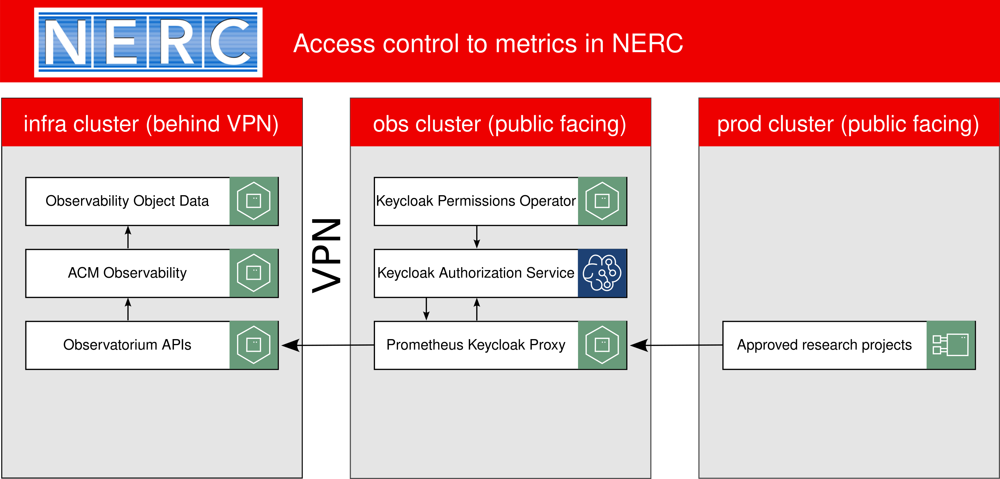
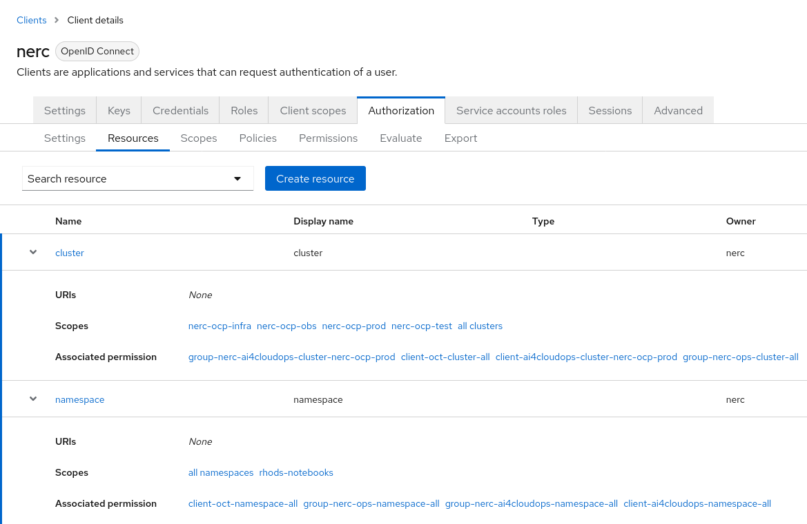
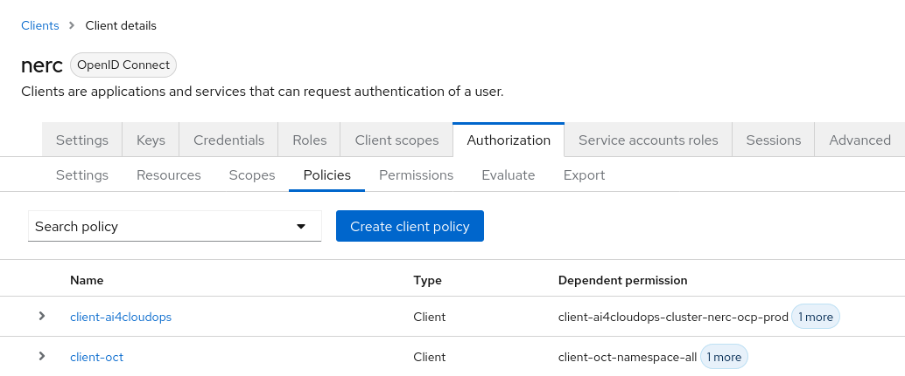
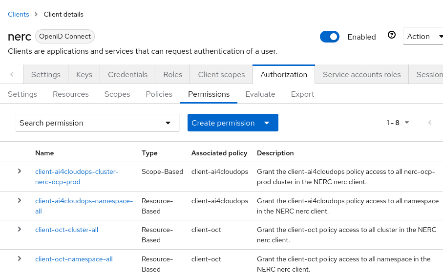

# Access control to metrics in NERC

## Use case

Protect and expose the ACM Observability metrics data through a secure proxy providing fine-grained resource permissions to the metrics.

## Background

The New England Research Cloud is a perfect environment for software cloud related research.
Because the metrics data for the New England Research Cloud OpenShift clusters is only found in the infra cluster behind a VPN,
we wish to protect and expose the metrics data through a secure proxy providing fine-grained resource permissions to the metrics.
Access to the metrics will be given to approved research projects for a defined period of time.
We provide the unique credentials to the research teams to access the metrics through a new Prometheus Keycloak Proxy and Keycloak Permissions Operator that we built for this purpose.

## Solution overview



- Research teams can build applications approved by the Red Hat Collaboratory with Boston University with access to the NERC OpenShift cluster metrics.
- The Keycloak service deployed on the `obs` cluster has been configured with research team policies and permissions to approved metrics, applied by our new [Keycloak Permissions Operator](https://github.com/nerc-images/keycloak-permissions-operator).
- The [NERC Observability admin team](https://github.com/orgs/OCP-on-NERC/teams/nerc-obs-admins) will share a Client ID and Client Secret in the OpenShift project of approved research teams given access to metrics on the `prod` cluster.
- A research application can use the Client ID and Client Secret to request a temporary access token from the Keycloak service deployed on the `obs` cluster.
- With a valid access token, the research application can make a request for metrics to the [Prometheus Keycloak Proxy](https://github.com/nerc-images/prom-keycloak-proxy) deployed on the `obs` cluster.
- The Prometheus Keycloak Proxy checks that the access token is valid, and parses the query string of the request to find out what metrics and resources the application is requesting.
- The Prometheus Keycloak Proxy will ask the Keycloak Authorization Service if the given access token has access to the requested resources.
  - If Keycloak does not find any permissions granted to the access token for the given resources, the request will fail with a `403 Forbidden` response code and error message.
  - If Keycloak finds permissions granted to the access token for all the resources in the request, then the request will be successful `200 OK`.
- With a successful response from the Keycloak Authorization Sevice, the Prometheus Keycloak Proxy will then query the Observatorium API on the `infra` cluster with the same URL path and query string and return the response JSON data to the research application.

## The technology

- [Red Hat Advanced Cluster Management Observability](https://www.redhat.com/en/technologies/management/advanced-cluster-management) provides a centralized hub for metrics, alerting, and monitoring of platforms for a multi-cluster environment. In addition, the observability component also focuses on displaying cluster health metrics, which describes the control plane health, cluster optimization and resource utilization. The service gets deployed automatically to each cluster when Observability is enabled in RHACM.
- [Red Hat Build of Keycloak Operator](https://access.redhat.com/products/red-hat-build-of-keycloak/) is a cloud-native Identity Access Management solution based on the popular open source Keycloak project. We configure a realm called `NERC`, and a main client called `nerc` where permissions to all clients are granted. We create a new client for each approved research team requiring access to metrics with the Red Hat Build of Keycloak Operator.
- [Keycloak Permissions Operator](https://github.com/nerc-images/keycloak-permissions-operator) is an OpenShift Operator for managing Keycloak resources, scopes, policies, and permissions for fine-grained resource permissions. This operator is built by the NERC software engineers. It's available as an OpenShift Operator, and a [Kubernetes Community Operator](https://operatorhub.io/operator/keycloak-permissions-operator).
- [Prometheus Keycloak Proxy](https://github.com/nerc-images/prom-keycloak-proxy) is a proxy for observatorium and prometheus on OpenShift, secured by Keycloak Fine-Grained Resource Permissions. This application is built by the NERC software engineers.

## NERC OpenShift clusters involved

- The NERC `infra` cluster is where the Red Hat Cluster Management Observability service is installed.
For more information, see our [NERC observability architecture documentation](README.md).
The Observability service provides a centralized hub for metrics, alerting, and monitoring of platforms for a multi-cluster environment.
The Observability service exposes the Observatorium API as a secured route which requires a certain TLS certificate, private key, and CA certificate required to connect.
The Observatorium API is also secured behind a Harvard VPN.
The [metrics query Observatorim APIs](https://observatorium.io/docs/api#tag/metricsqueryv1) will be queried by services deployed on the `obs` cluster.
This prevents any approved researchers from building approved applications for querying and reporting on our NERC OpenShift metrics.
- The NERC `obs` cluster is where we deploy 2 new services to authenticate applications and users wishing to query NERC metrics.
We configure the clusters, namespaces, and metrics they wish to connect to, and grant them permissions to approved resources with the new [Keycloak Permissions Operator](https://github.com/nerc-images/keycloak-permissions-operator) we built for this purpose together with the [Red Hat Build of Keycloak Operator](https://access.redhat.com/products/red-hat-build-of-keycloak/).
Our new [Prometheus Keycloak Proxy](https://github.com/nerc-images/prom-keycloak-proxy) application we built checks their authorizations to metrics resources before querying any [Observatorim API metrics](https://observatorium.io/docs/api#tag/metricsqueryv1) they have requested.
We have configured the Prometheus Keycloak Proxy with the TLS certificate, private key, and CA certificate required to connect to observatorium behind the VPN on the infra cluster.
- The NERC `prod` cluster is where our approved research applications will connect to the Prometheus Keycloak Proxy on the `obs` cluster to query Observatorim API metrics.

## Keycloak authorization services

Keycloak provides a complete solution for defining fine-grained resource permissions for NERC clients to access metrics resources. Our new Keycloak Permissions Operator makes this configuration easy.

### Keycloak resources and scopes

We start by defining `cluster`, and `namespace` resources, with scopes that represent the clusters and namespaces in NERC we wish to grant access to.



### Keycloak client policies
We define the client policies which represent teams who will be given a client ID and client secret to connect to Keycloak and Prometheus Keycloak Proxy to query metrics.



### Keycloak permissions

Last, we define permissions for our research team client policies to access certain resources with certain scopes.



## Solution details

Research teams can build applications approved by the Red Hat Collaboratory with Boston University with access to the NERC OpenShift cluster metrics, and get access to a project allocation on NERC OpenShift.

```bash
OPENSHIFT_PROJECT=our-team-project
```

- The [NERC Observability admin team](https://github.com/orgs/OCP-on-NERC/teams/nerc-obs-admins) will share a Secret named `prom-keycloak-proxy` in their NERC OpenShift project containing the Client ID, Client Secret, auth token URL, and metrics URL for access to metrics.

```bash
  AUTH_CLIENT_ID=$(oc -n $OPENSHIFT_PROJECT get secret/prom-keycloak-proxy -o jsonpath={.data.AUTH_CLIENT_ID} | base64 -d)

  AUTH_CLIENT_SECRET=$(oc -n $OPENSHIFT_PROJECT get secret/prom-keycloak-proxy -o jsonpath={.data.AUTH_CLIENT_SECRET} | base64 -d)

  AUTH_TOKEN_URL=$(oc -n $OPENSHIFT_PROJECT get secret/prom-keycloak-proxy -o jsonpath={.data.AUTH_TOKEN_URL} | base64 -d)

  METRICS_URL=$(oc -n $OPENSHIFT_PROJECT get secret/prom-keycloak-proxy -o jsonpath={.data.METRICS_URL} | base64 -d)
```

- A research application can request a temporary access token from the Keycloak service deployed on the `obs` cluster at this URL https://keycloak.apps.obs.nerc.mghpcc.org/realms/NERC/protocol/openid-connect/token.

```bash
AUTH_TOKEN=$(curl -X POST -k -s -u "$AUTH_CLIENT_ID:$AUTH_CLIENT_SECRET" \
  -d "grant_type=client_credentials" \
  "$AUTH_TOKEN_URL" \
  | jq -r ".access_token")
```

- The research application can then query the various metrics APIs that have a method GET, using the [Observatorim API query metrics](https://observatorium.io/docs/api#tag/metricsqueryv1) at this metrics URL https://metrics.apps.obs.nerc.mghpcc.org/.

```bash
METRICS_DURATION="12 hours"
METRICS_START=$(date -u -d "$METRICS_DURATION ago" '+%s')
METRICS_END=$(date -u '+%s')
METRICS_STEP=5

curl -i "$METRICS_URL/api/v1/query_range" --get \
  --data-urlencode "start=$METRICS_START" \
  --data-urlencode "end=$METRICS_END" \
  --data-urlencode "step=$METRICS_STEP" \
  --data-urlencode 'query=cluster:cpu_usage_cores:sum{cluster="nerc-ocp-prod"}' \
  -H "Content-Type: application/json" \
  -H "Authorization: Bearer $AUTH_TOKEN"
```

## Complete metrics authorization query example

Here is a complete metrics authorization query example that a team can use to debug a connection to the prom-keycloak-proxy directly in their OpenShift project in NERC by obtaining a valid auth token and querying the prom-keycloak-proxy.
Please remember to keep metrics data and credentials inside of the Mass Open Cloud, and not exposed.

Log into the [NERC OpenShift Console](https://console.apps.shift.nerc.mghpcc.org) and `Copy login command`, and paste the command in your terminal.

Set your OpenShift project name in an environment variable in your Terminal.

```bash
OPENSHIFT_PROJECT=my-team-project
```

Run a RHEL debug pod in your OpenShift project with the 4 environment variables defined from your project's `prom-keycloak-proxy` secret.

```bash
oc --as system:admin -n $OPENSHIFT_PROJECT debug \
  AUTH_CLIENT_ID=$(oc -n $OPENSHIFT_PROJECT get secret/prom-keycloak-proxy -o jsonpath={.data.AUTH_CLIENT_ID} | base64 -d) \
  AUTH_CLIENT_SECRET=$(oc -n $OPENSHIFT_PROJECT get secret/prom-keycloak-proxy -o jsonpath={.data.AUTH_CLIENT_SECRET} | base64 -d) \
  AUTH_TOKEN_URL=$(oc -n $OPENSHIFT_PROJECT get secret/prom-keycloak-proxy -o jsonpath={.data.AUTH_TOKEN_URL} | base64 -d) \
  METRICS_URL=$(oc -n $OPENSHIFT_PROJECT get secret/prom-keycloak-proxy -o jsonpath={.data.METRICS_URL} | base64 -d)
```

Inside of the RHEL debug pod, obtain a temporary access token from Keycloak.

```bash
AUTH_TOKEN=$(curl -X POST -k -s -u "$AUTH_CLIENT_ID:$AUTH_CLIENT_SECRET" \
  -d "grant_type=client_credentials" \
  "$AUTH_TOKEN_URL" \
  | jq -r ".access_token")
```

Also inside of the RHEL debug pod, set up a prometheus query to the [Observatorim API query metrics](https://observatorium.io/docs/api#tag/metricsqueryv1).

```bash
METRICS_DURATION="12 hours"
METRICS_START=$(date -u -d "$METRICS_DURATION ago" '+%s')
METRICS_END=$(date -u '+%s')
METRICS_STEP=5

curl -i "$METRICS_URL/api/v1/query_range" --get \
  --data-urlencode "start=$METRICS_START" \
  --data-urlencode "end=$METRICS_END" \
  --data-urlencode "step=$METRICS_STEP" \
  --data-urlencode 'query=cluster:cpu_usage_cores:sum{cluster="nerc-ocp-prod"}' \
  -H "Content-Type: application/json" \
  -H "Authorization: Bearer $AUTH_TOKEN"
```

## Restricted access to certain clusters, namespaces, and metrics for some teams

Please note that your project may not have access to all clusters and all namespaces.

- Some teams will only be granted access to metrics on the NERC OpenShift Production cluster, which will require them to append a cluster filter to their query for metrics `{cluster="nerc-ocp-prod"}`.
- Some teams will only be granted access to metrics on the NERC OpenShift Test cluster, which will require them to append a cluster filter to their query for metrics `{cluster="nerc-ocp-test"}`.
- Some teams will only be granted access to metrics to OpenShift AI class workbenches on the NERC OpenShift Production cluster, which will require them to append a cluster filter and a namespace filter to their query for metrics `{cluster="nerc-ocp-prod", namespace="rhods-notebooks"}`.

If you query metrics that you do not have access to, expect to see a `403 Forbidden` response like this:

```bash
HTTP/1.1 403 Forbidden
vary: Origin
date: Tue, 21 May 2024 15:50:31 GMT
content-length: 95
content-type: text/plain; charset=utf-8
set-cookie: bd21429ef636acf1c4bb4c21c2977b78=f5584da9b16611567339144dfb2f002f; path=/; HttpOnly; Secure; SameSite=None

{"code":401,"error":"Unauthorized","message":"You are not authorized to access this resource"}
```
