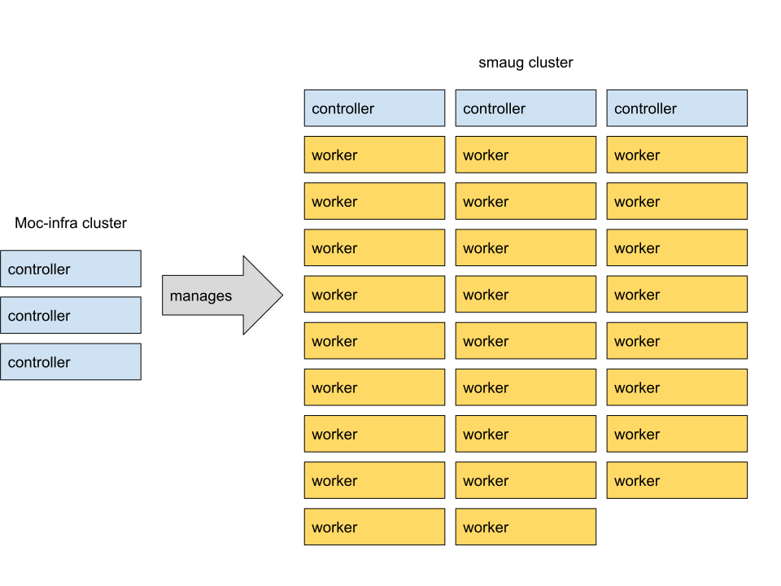
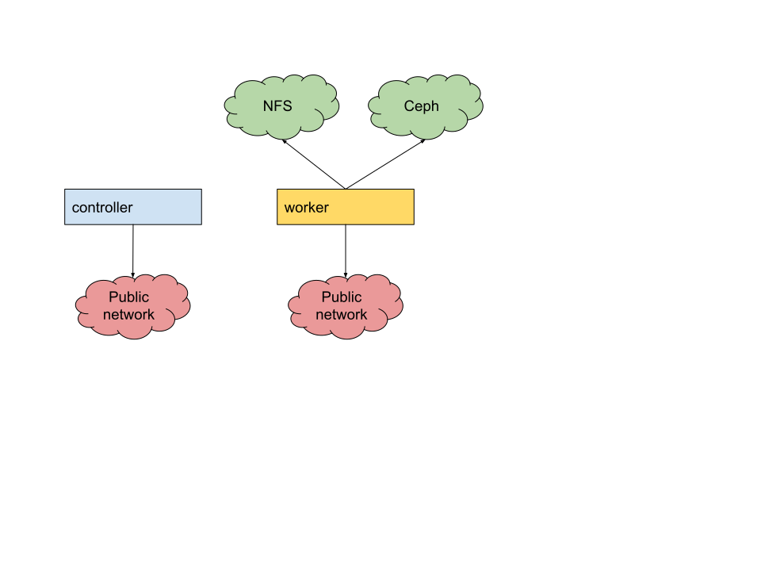

# Operate first cluster

This document describes the hardware architecture of the Operate First "Smaug" cluster, which is the environment we're using as a model for the NERC OpenShift deployment.

## Infra cluster

The Operate First environment (OPF) has a three-node "infra" cluster used to run a suite of tooling used to manage the other clusters. This includes:

- [ACM](https://www.redhat.com/en/technologies/management/advanced-cluster-management/)
- [ArgoCD](https://argo-cd.readthedocs.io/en/stable/)
- [Keycloak](https://www.keycloak.org/)

The infra nodes are Dell PowerEdge R620s, each with 16 Intel Xeon E5-2660 processors and 256GB RAM.

## User workload cluster hardware overview

The user workload cluster (named "Smaug") consists of three control nodes and 26 worker nodes.

### Control nodes

The controllers are Dell PowerEdge R640 servers with Xeon 6248R processors and 384GB RAM.

### Worker nodes

The workers are primarily Dell PowerEdge R620s with between 128 and 384 GB of RAM, and mostly have Xeon E5-2660 processors.

## User workload cluster networking overview

All systems in the cluster have a pair of 10Gb interfaces.

### Control nodes

The controllers are attached to a single network on which they have a public IP address. This is used both for user-facing traffic as well as for in-cluster communication.

### Worker nodes

The workers nodes have their first interface attached to the public network, used both for user-facing traffic as well as for in-cluster communication.

These nodes have two VLANs attached to their second interface:

- One that provides access to a NFS server
- One that provides access to our Ceph cluster

The Ceph cluster is our primary storage; the NFS server was a stop-gap solution while we were investigating how to declaratively install [ODF][] (neé OCS) with an external Ceph cluster.

[odf]: https://www.redhat.com/en/technologies/cloud-computing/openshift-data-foundation

## Authentication/Authorization

The Operate First cluster is configured to use [GitHub][] as the primary source of authentication information. OpenShift can be configured to work with any [OIDC][] capable [identity provider][], including KeyCloak and Dex.

[github]: https://github.com
[oidc]: https://openid.net/connect/
[identity provider]: https://docs.openshift.com/container-platform/4.9/authentication/understanding-identity-provider.html#supported-identity-providers

We need to know what we'll be using for authentication on the NERC cluster.

On Smaug, authorization is maintained manually via `Group` objects in the cluster, provisioned through a GitOps workflow driven by ArgoCD. There is a [group sync operator][] available that would allow us to synchronize authorization information with an upstream IDP.

[group sync operator]: https://github.com/redhat-cop/group-sync-operator

## Onboarding

On Smaug, anybody with a valid GitHub account is able to authenticate. While initially they will not have any privileges on the cluster, they will still be able to create an account. This behavior may not be desirable in the NERC environment, in which case we will want to configure the identity provider in `lookup` rather than `claim` mode, and delegate account creation to some sort of external tooling.
