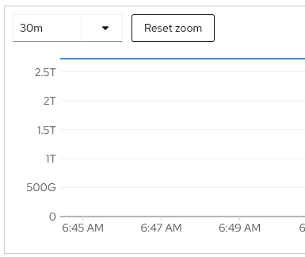
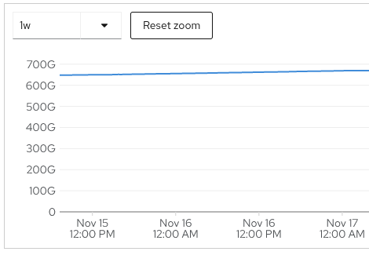
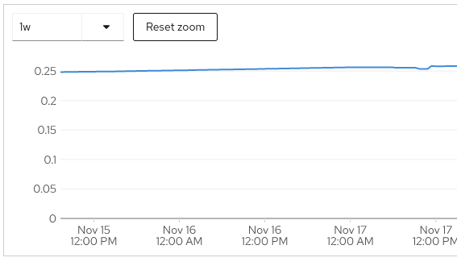

# Quick Links

- [ACM Observability Monitoring Grafana Dashboard](https://grafana-open-cluster-management-observability.apps.nerc-ocp-infra.rc.fas.harvard.edu)
- [Multi Cluster Logging with Loki Operator](https://console-openshift-console.apps.nerc-ocp-infra.rc.fas.harvard.edu/monitoring/logs)
- [OpenShift Data Foundations Ceph Storage Percent Used in OpenShift Monitoring](https://console-openshift-console.apps.nerc-ocp-infra.rc.fas.harvard.edu/monitoring/query-browser?query0=sum%28%28kubelet_volume_stats_used_bytes+*+on+%28namespace%2Cpersistentvolumeclaim%29+group_right%28%29+kube_pod_spec_volumes_persistentvolumeclaims_info%29+*+on+%28namespace%2Cpersistentvolumeclaim%29+group_left%28storageclass%2C+provisioner%29+%28kube_persistentvolumeclaim_info+*+on+%28storageclass%29++group_left%28provisioner%29+kube_storageclass_info+%7Bprovisioner%3D%7E%22%28.*rbd.csi.ceph.com%29%7C%28.*cephfs.csi.ceph.com%29%7C%28ceph.rook.io%2Fblock%29%22%7D%29%29%2Fsum%28%28kube_persistentvolumeclaim_resource_requests_storage_bytes+*+on+%28namespace%2Cpersistentvolumeclaim%29+group_right%28%29+kube_pod_spec_volumes_persistentvolumeclaims_info%29+*+on+%28namespace%2Cpersistentvolumeclaim%29+group_left%28storageclass%2C+provisioner%29+%28kube_persistentvolumeclaim_info+*+on+%28storageclass%29++group_left%28provisioner%29+kube_storageclass_info+%7Bprovisioner%3D%7E%22%28.*rbd.csi.ceph.com%29%7C%28.*cephfs.csi.ceph.com%29%7C%28ceph.rook.io%2Fblock%29%22%7D%29%29)

## Switching to new Observability Cluster - Design, Current Status & Changes
- Design: [Logging System](https://github.com/OCP-on-NERC/docs/blob/main/architecture/logging/portfolio.md)
- Design: [Observability Architecture](https://github.com/OCP-on-NERC/docs/blob/main/architecture/observability/README.md)

# Monitoring

- Monitoring in the cluster is provided by the Red Hat [Advanced Cluster Management Operator here](https://console-openshift-console.apps.nerc-ocp-infra.rc.fas.harvard.edu/k8s/ns/openshift-logging/operators.coreos.com~v1alpha1~ClusterServiceVersion).

## MultiClusterObservability component
- The ACM MultiClusterObservability component allows us to configure the storage class, storage size, rule storage size, receive storage size, compact storage size, alert manager storage size, metric object storage bucket, interval, and downsampling of the observability. It also allows us to configure the replicas and node selectors for each of the observability components (store, receive, grafana, query, alert manager, store memcached, RBAC query proxy, observatorium API, query frontend, rule, and query frontend memcached. See the [Multi Cluster Observability component here](https://console-openshift-console.apps.nerc-ocp-infra.rc.fas.harvard.edu/k8s/cluster/observability.open-cluster-management.io~v1beta2~MultiClusterObservability/observability).
- You can find the observability components in the [open-cluster-management-observability namespace here](https://console-openshift-console.apps.nerc-ocp-infra.rc.fas.harvard.edu/search/ns/open-cluster-management-observability?kind=apps%7Ev1%7EDeployment%2Capps%7Ev1%7EStatefulSet%2Croute.openshift.io%7Ev1%7ERoute%2Ccore%7Ev1%7EService).

## Monitoring Troubleshooting

### Drop and Recreate multicluster-engine Operator

In case you encounter errors with ACM upgrades and Observability, it may be due to the multicluster-engine being out of sync with old ACM data:

`
E1212 15:28:42.757827 1 helmreleasemgr.go:99] failed to download chart from helm repo. - url: http://multiclusterhub-repo.open-cluster-management.svc.cluster.local:3000/charts/policyreport-2.5.3.tgz error: return code: 404 unable to retrieve chart - Failed to download the chart
`

`
error validating existing CRs against new CRD's schema for "multiclusterobservabilities.observability.open-cluster-management.io": error listing resources in GroupVersionResource schema.GroupVersionResource{Group:"observability.open-cluster-management.io", Version:"v1beta1", Resource:"multiclusterobservabilities"}: conversion webhook for observability.open-cluster-management.io/v1beta2, Kind=MultiClusterObservability failed: Post "https://multicluster-observability-webhook-service.open-cluster-management.svc:443/convert?timeout=30s": no endpoints available for service "multicluster-observability-webhook-service"
`

It requires deleting the multicluster-engine Subscription and CSV, deleting the openshift-monitoring pods, and deleting the ACM Subscription, CSV, and MultiClusterObservability CRD, and putting it all back again.

## Using the Monitoring tools

### Monitoring and logging for the infrastructure hardware and software that is not OpenShift (for example Grafana).

As a NERC administrator, I should be able to monitor the status of any infrastructure software or hardware that supports operations for the NERC OpenShift environment, even if it is not itself part of OpenShift.

### Steps for reporting

You can access many metrics for pods of applications in a namespace. See some of the available logs and metrics:

- [Click here to visit the cpu usage logs for dex](https://grafana-open-cluster-management-observability.apps.nerc-ocp-infra.rc.fas.harvard.edu/explore?orgId=1&left=%5B%22now-1h%22,%22now%22,%22Observatorium%22,%7B%22exemplar%22:true,%22expr%22:%22node_namespace_pod_container:container_cpu_usage_seconds_total:sum_rate%7Bnamespace%3D%5C%22dex%5C%22%7D%22%7D%5D).
- [Click here to visit the cpu usage logs for gitops](https://grafana-open-cluster-management-observability.apps.nerc-ocp-infra.rc.fas.harvard.edu/explore?orgId=1&left=%5B%22now-1h%22,%22now%22,%22Observatorium%22,%7B%22exemplar%22:true,%22expr%22:%22node_namespace_pod_container:container_cpu_usage_seconds_total:sum_rate%7Bnamespace%3D%5C%22openshift-gitops%5C%22%7D%22%7D%5D).
- [Click here to visit the cpu usage logs for grafana](https://grafana-open-cluster-management-observability.apps.nerc-ocp-infra.rc.fas.harvard.edu/explore?orgId=1&left=%5B%22now-1h%22,%22now%22,%22Observatorium%22,%7B%22exemplar%22:true,%22expr%22:%22node_namespace_pod_container:container_cpu_usage_seconds_total:sum_rate%7Bnamespace%3D%5C%22grafana%5C%22%7D%22%7D%5D).
- [Click here to visit the cpu usage logs for logging](https://grafana-open-cluster-management-observability.apps.nerc-ocp-infra.rc.fas.harvard.edu/explore?orgId=1&left=%5B%22now-1h%22,%22now%22,%22Observatorium%22,%7B%22exemplar%22:true,%22expr%22:%22node_namespace_pod_container:container_cpu_usage_seconds_total:sum_rate%7Bnamespace%3D%5C%22openshift-logging%5C%22%7D%22%7D%5D).
- [Click here to visit the cpu usage logs for loki](https://grafana-open-cluster-management-observability.apps.nerc-ocp-infra.rc.fas.harvard.edu/explore?orgId=1&left=%5B%22now-1h%22,%22now%22,%22Observatorium%22,%7B%22exemplar%22:true,%22expr%22:%22node_namespace_pod_container:container_cpu_usage_seconds_total:sum_rate%7Bnamespace%3D%5C%22openshift-logging%5C%22%7D%22%7D%5D).
- [Click here to visit the cpu usage logs for vault](https://grafana-open-cluster-management-observability.apps.nerc-ocp-infra.rc.fas.harvard.edu/explore?orgId=1&left=%5B%22now-1h%22,%22now%22,%22Observatorium%22,%7B%22exemplar%22:true,%22expr%22:%22node_namespace_pod_container:container_cpu_usage_seconds_total:sum_rate%7Bnamespace%3D%5C%22vault%5C%22%7D%22%7D%5D).
- [Click here to visit the cpu usage logs for xdmod](https://grafana-open-cluster-management-observability.apps.nerc-ocp-infra.rc.fas.harvard.edu/explore?orgId=1&left=%5B%22now-1h%22,%22now%22,%22Observatorium%22,%7B%22exemplar%22:true,%22expr%22:%22node_namespace_pod_container:container_cpu_usage_seconds_total:sum_rate%7Bnamespace%3D%5C%22xdmod%5C%22%7D%22%7D%5D).

## Using the Reporting tools

### Track/report usage of the cluster

As an administrator of the cluster, I should be able to view daily, weekly, and monthly reports of the cluster infrastructure utilization.

#### Steps

- Administrator logs into the associated XDMoD instance and views reports.
- [Click here to view the ACM Observability Grafana dashboards](https://grafana-open-cluster-management-observability.apps.nerc-ocp-infra.rc.fas.harvard.edu/). These dashboards provide insights into Control Plane Health, Optimization, Capacity, Utilization, and more. You can change the timespan in the top right to show results in terms of minutes, hours, days, months or years.

### Track/report usage of the project
As a user and the owner of a project, I should be able to view daily, weekly, and monthly reports of the infrastructure utilization by the projects I own.

#### Steps to track usage

- User logs into the associated XDMoD instance and views reports for projects they own.
- Users cannot view reports for projects they do not own. We will need to look into this, to restrict the view to only projects that they own.
- [Click here to view the memory usage of projects over time](https://grafana-open-cluster-management-observability.apps.nerc-ocp-infra.rc.fas.harvard.edu/explore?orgId=1&left=%5B%22now-1h%22,%22now%22,%22Observatorium%22,%7B%22exemplar%22:true,%22expr%22:%22namespace:container_memory_usage_bytes:sum%22%7D%5D).
- [Click here to view the CPU usage of the projects over time](https://grafana-open-cluster-management-observability.apps.nerc-ocp-infra.rc.fas.harvard.edu/explore?orgId=1&left=%5B%22now-1h%22,%22now%22,%22Observatorium%22,%7B%22exemplar%22:true,%22expr%22:%22node_namespace_pod_container:container_cpu_usage_seconds_total:sum%22%7D%5D).
- [Click here to show the projects using the top 5 CPU usage at each point in time](https://grafana-open-cluster-management-observability.apps.nerc-ocp-infra.rc.fas.harvard.edu/explore?orgId=1&left=%5B%22now-1h%22,%22now%22,%22Observatorium%22,%7B%22exemplar%22:true,%22expr%22:%22topk%285,%20%281%20-%20avg%28rate%28node_namespace_pod_container:container_cpu_usage_seconds_total:sum%7B%7D%5B$__rate_interval%5D%29%29%20by%20%28namespace%29%29%29%22%7D%5D).

### Ceph Storage Space Monitoring

Log archiving and rollover could run the Ceph Storage out of space. Because the metrics to calculate space on the ceph cluster are not yet sent to Observability, they are available in the OpenShift Monitoring instead. Check on log storage space consumed vs. available using these OpenShift metrics:

1. [OpenShift Data Foundations Ceph Storage Total Storage](https://console-openshift-console.apps.nerc-ocp-infra.rc.fas.harvard.edu/monitoring/query-browser?query0=sum%28%28kube_persistentvolumeclaim_resource_requests_storage_bytes+*+on+%28namespace%2Cpersistentvolumeclaim%29+group_right%28%29+kube_pod_spec_volumes_persistentvolumeclaims_info%29+*+on+%28namespace%2Cpersistentvolumeclaim%29+group_left%28storageclass%2C+provisioner%29+%28kube_persistentvolumeclaim_info+*+on+%28storageclass%29++group_left%28provisioner%29+kube_storageclass_info+%7Bprovisioner%3D%7E%22%28.*rbd.csi.ceph.com%29%7C%28.*cephfs.csi.ceph.com%29%7C%28ceph.rook.io%2Fblock%29%22%7D%29%29)

    
2. [OpenShift Data Foundations Ceph Storage Storage Used](https://console-openshift-console.apps.nerc-ocp-infra.rc.fas.harvard.edu/monitoring/query-browser?query0=sum%28%28kubelet_volume_stats_used_bytes+*+on+%28namespace%2Cpersistentvolumeclaim%29+group_right%28%29+kube_pod_spec_volumes_persistentvolumeclaims_info%29+*+on+%28namespace%2Cpersistentvolumeclaim%29+group_left%28storageclass%2C+provisioner%29+%28kube_persistentvolumeclaim_info+*+on+%28storageclass%29++group_left%28provisioner%29+kube_storageclass_info+%7Bprovisioner%3D%7E%22%28.*rbd.csi.ceph.com%29%7C%28.*cephfs.csi.ceph.com%29%7C%28ceph.rook.io%2Fblock%29%22%7D%29%29)

    
3. [OpenShift Data Foundations Ceph Storage Percent Used](https://console-openshift-console.apps.nerc-ocp-infra.rc.fas.harvard.edu/monitoring/query-browser?query0=sum%28%28kubelet_volume_stats_used_bytes+*+on+%28namespace%2Cpersistentvolumeclaim%29+group_right%28%29+kube_pod_spec_volumes_persistentvolumeclaims_info%29+*+on+%28namespace%2Cpersistentvolumeclaim%29+group_left%28storageclass%2C+provisioner%29+%28kube_persistentvolumeclaim_info+*+on+%28storageclass%29++group_left%28provisioner%29+kube_storageclass_info+%7Bprovisioner%3D%7E%22%28.*rbd.csi.ceph.com%29%7C%28.*cephfs.csi.ceph.com%29%7C%28ceph.rook.io%2Fblock%29%22%7D%29%29%2Fsum%28%28kube_persistentvolumeclaim_resource_requests_storage_bytes+*+on+%28namespace%2Cpersistentvolumeclaim%29+group_right%28%29+kube_pod_spec_volumes_persistentvolumeclaims_info%29+*+on+%28namespace%2Cpersistentvolumeclaim%29+group_left%28storageclass%2C+provisioner%29+%28kube_persistentvolumeclaim_info+*+on+%28storageclass%29++group_left%28provisioner%29+kube_storageclass_info+%7Bprovisioner%3D%7E%22%28.*rbd.csi.ceph.com%29%7C%28.*cephfs.csi.ceph.com%29%7C%28ceph.rook.io%2Fblock%29%22%7D%29%29)

    

## MultiClusterObservability documentation

Here are some useful links to the MultiClusterObservability documentation:

- [APIs Red Hat Advanced Cluster Management for Kubernetes 2.5](https://access.redhat.com/documentation/en-us/red_hat_advanced_cluster_management_for_kubernetes/2.5/html/apis/apis#rhacm-docs_apis_multiclusterobservability_jsonmulticlusterobservability_observabilityadvanced)
- [Observing environments introduction Red Hat Advanced Cluster Management for Kubernetes 2.5](https://access.redhat.com/documentation/en-us/red_hat_advanced_cluster_management_for_kubernetes/2.5/html/observability/observing-environments-intro#enabling-observability)
- [Managing applications Red Hat Advanced Cluster Management for Kubernetes 2.0](https://access.redhat.com/documentation/en-us/red_hat_advanced_cluster_management_for_kubernetes/2.0/html/manage_applications/managing-applications)

# Logging

## Logging Operators

- Logging in the cluster is provided by the Red Hat [Red Hat OpenShift Logging here](https://console-openshift-console.apps.nerc-ocp-infra.rc.fas.harvard.edu/k8s/ns/openshift-logging/operators.coreos.com~v1alpha1~ClusterServiceVersion).
- We combine the OpenShift Logging Operator with the [Loki Operator here](https://console-openshift-console.apps.nerc-ocp-infra.rc.fas.harvard.edu/k8s/ns/openshift-logging/operators.coreos.com~v1alpha1~ClusterServiceVersion), so that the Logging Operator sends the infrastructure, audit, and application logs to the Loki Operator where they are stored in an Object Bucket.
- The OpenShift Logging Operator has a dependency on the [Elasticsearch Operator here](https://console-openshift-console.apps.nerc-ocp-infra.rc.fas.harvard.edu/k8s/ns/openshift-logging/operators.coreos.com~v1alpha1~ClusterServiceVersion). Whether you use Elasticsearch for storing logs or using Loki, you still need the Elasticsearch Operator installed for required dependent CustomResourceDefinitions.

### Loki operator

- The Loki Operator allows you to set up LokiStacks, AlertingRules, RecordingRules, and RulerConfigs based on your cluster logs for infrastructure, audit, and applications. See the [ Loki Operator here ](https://console-openshift-console.apps.nerc-ocp-infra.rc.fas.harvard.edu/k8s/ns/openshift-logging/operators.coreos.com~v1alpha1~ClusterServiceVersion)
- Setting up a LokiStack allows you to configure the size of a cluster logging system that you desire in terms of storage and replicas. [ LokiStack here ](https://console-openshift-console.apps.nerc-ocp-infra.rc.fas.harvard.edu/k8s/ns/openshift-logging/loki.grafana.com~v1~LokiStack/logging-loki)
- Setting up a LokiStack involves configuring persistent storage by storageClassName for Persistent Volume Claims. [ ocs-external-storagecluster-ceph-rbd storage class here ](https://console-openshift-console.apps.nerc-ocp-infra.rc.fas.harvard.edu/k8s/cluster/storageclasses/ocs-external-storagecluster-ceph-rbd)
- Setting up a LokiStack involves configuring object storage by a secret named "thanos-object-storage" in the "openshift-logging" namespace containing the access_key_id, access_key_secret, bucketnames, and endpoint of the object storage.
- The object storage for Loki is provided by OpenShift Data Foundations. See the [ openshift-logging-objectbucketclaim Object Bucket Claim here ](https://console-openshift-console.apps.nerc-ocp-infra.rc.fas.harvard.edu/k8s/ns/openshift-logging/objectbucket.io~v1alpha1~ObjectBucketClaim/openshift-logging-objectbucketclaim)
- The [ The infra and prod Cluster Logs are available on the infra cluster here ](https://console-openshift-console.apps.nerc-ocp-infra.rc.fas.harvard.edu/monitoring/logs)

## Tracking events in the Logging System

As an administrator of the cluster, I should be able to track all the events in the cluster using the logging system in OpenShift.

### Steps

- [Click here to visit the Logs](https://console-openshift-console.apps.nerc-ocp-infra.rc.fas.harvard.edu/monitoring/logs).
- You can easily filter by recent date, or date range in the past.
- You can easily filter by content, namespaces, pods, and containers.
- You can also filter by log levels: critical, error, warning, info, debug, trace, unknown.
- Click "Show Query" to add more advanced filters like cluster ID:
    - [Here are the logs for the infra cluster](https://console-openshift-console.apps.nerc-ocp-infra.rc.fas.harvard.edu/monitoring/logs?q=%7B+log_type+%3D%7E+%22.%2B%22+%7D+%7C+json+%7C+openshift_cluster_id%3D%22b3c6e302-f119-4adb-bc48-e04c6aa2eaa5%22), you can also add the following query to the end of your log query to filter on infra cluster logs: ` | openshift_cluster_id="b3c6e302-f119-4adb-bc48-e04c6aa2eaa5"`
    - [Here are the logs for the prod cluster](https://console-openshift-console.apps.nerc-ocp-infra.rc.fas.harvard.edu/monitoring/logs?q={+log_type+%3D~+%22.%2B%22+}+|+json+|+openshift_cluster_id%3D%22fcb727d6-3e61-4d23-913d-756cf41c7982%22), you can also add the following query to the end of your log query to filter on infra cluster logs: ` | openshift_cluster_id="fcb727d6-3e61-4d23-913d-756cf41c7982"`
- NERC Admins have access to application logs.
- Infrastructure and audit logs have always been reserved to cluster admins in OpenShift Logging ( even on the old stack with Elasticsearch). LokiStack is best configured for admin access via a group (currently we support three dedicated names cluster-admin, dedicated-admin and the standard group for kubeadmin). These groups require a ClusterRoleBinding to the ClusterAdmin ClusterRole.

## Cluster Logging documentation

Here are some useful links to the MultiClusterObservability documentation:

- [Chapter 7. Forwarding logs to external third-party logging systems OpenShift Container Platform 4.10](https://access.redhat.com/documentation/en-us/openshift_container_platform/4.10/html/logging/cluster-logging-external#cluster-logging-collector-log-forward-loki_cluster-logging-external)
- [Logging OpenShift Container Platform 4.10](https://access.redhat.com/documentation/en-us/openshift_container_platform/4.10/html-single/logging/index#cluster-logging-exported-fields-kubernetes_cluster-logging-exported-fields)
- [Exported fields | Logging | OpenShift Container Platform 4.10](https://docs.openshift.com/container-platform/4.10/logging/cluster-logging-exported-fields.html#cluster-logging-exported-fields-kubernetes_cluster-logging-exported-fields)
- [Deploying Cluster Logging](https://docs.openshift.com/container-platform/4.10/logging/cluster-logging-deploying.html)
- [Multi-tenancy | Grafana Loki documentation](https://grafana.com/docs/loki/latest/operations/multi-tenancy/)
- [Grafana Configuration](https://grafana.com/docs/loki/latest/configuration/)
- [HTTP API | Grafana Loki documentation](https://grafana.com/docs/loki/latest/api/#push-log-entries-to-loki)
- [Forwarding Logs to LokiStack - Loki Operator](https://loki-operator.dev/docs/forwarding_logs_to_gateway.md/)
- [API - Loki Operator](https://loki-operator.dev/docs/api.md/#opaspec)
- [Configure generic OAuth authentication | Grafana documentation](https://grafana.com/docs/grafana/latest/setup-grafana/configure-security/configure-authentication/generic-oauth/)
