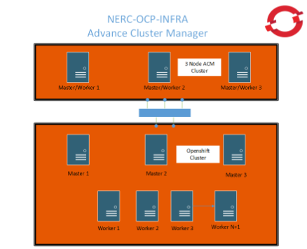

# SCALING RECOMMENDATIONS

## NERC OpenShift

### Michael Thomas Red Hat Architect

# RED HAT OPENSHIFT

Scalability

Red Hat Openshift can be scaled in various ways. The overall concern on
scaling should be driven by the applicable workloads. Group “like”
workloads on Specific Openshift Clusters. Scale Clusters by workloads.
Advanced Cluster Management can be applied to Clusters of all sizes,
whichever size you select.

- Small Clusters increase administrative workload

- Small Clusters isolate changes to specific workloads

- Small Clusters require etcd management with backups

- Small Clusters can be more specific in configurations

- Small Clusters are timely in recreating (when necessary)

- Large Clusters increase the size and complexity of the etcd database
and its recurring backups

- Large Clusters simplify storage access

- Large Clusters increase impact scale

- Large Clusters increase upgrade times

The previous list should be thoughtfully considered and then used to
formulate a valid scale process for the NERC organization. My
recommendation is for a hybrid approach. Have a large Openshift cluster
when the workloads are similar and requires compute resources heavily.
Utilize small Openshift clusters when the workload is specific, requires
isolation, and requires separation from other workloads.

Small clusters can be scaled up and large clusters can be scaled down,
as necessary. You have some space to experiment with scalability.
You can oversize and undersize with the ability to correct the sizing
in either direction.

The Keys to a successful hybrid approach are the use of automation to
create and manage all size clusters with standardization, having
management procedures well documented and enforced,  leveraging the
management of multiple clusters along with enforcing polices through
Advance Cluster Management (ACM), and utilizing limits and quotas to
protect Openshift cluster resources.

